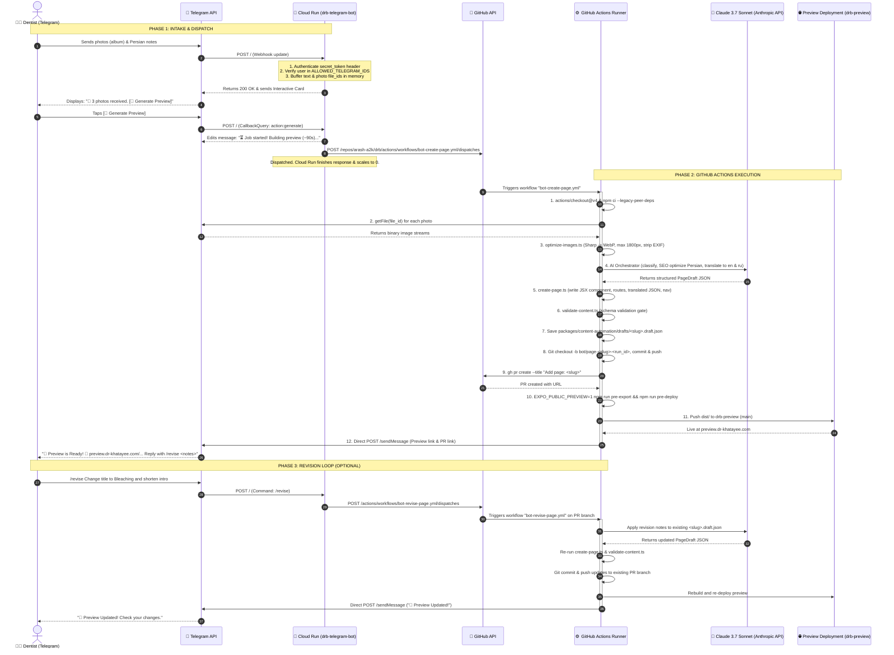

# Telegram Content Bot - End-to-End Sequence & Data Flow Diagram

This diagram traces the full chronological lifecycle of a page creation request, background GitHub Actions execution, preview deployment, and the optional revision loop.

---

## Phase Breakdown

1. **Phase 1: Intake & Dispatch:** Rapid, asynchronous buffer in Cloud Run. Allows user to send multiple photos and notes without waiting.
2. **Phase 2: GitHub Actions Execution:** Heavy lifting (image compression, AI prompt chaining, schema validation, static build, and deploy) executed with full compute resources.
3. **Phase 3: Revision Loop:** Allows unlimited iterative refinements on the same PR branch with automatic preview re-export.
