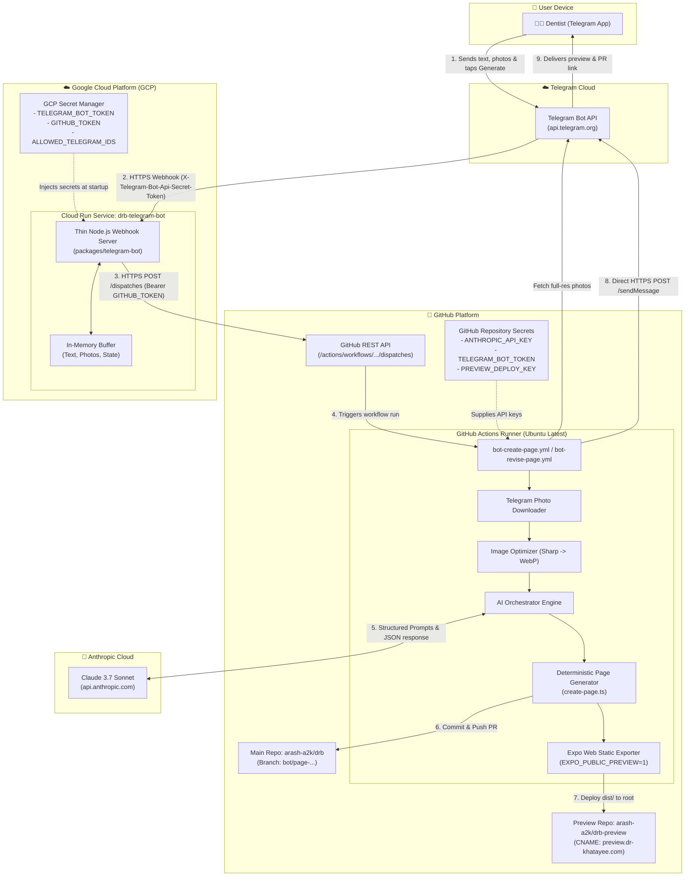
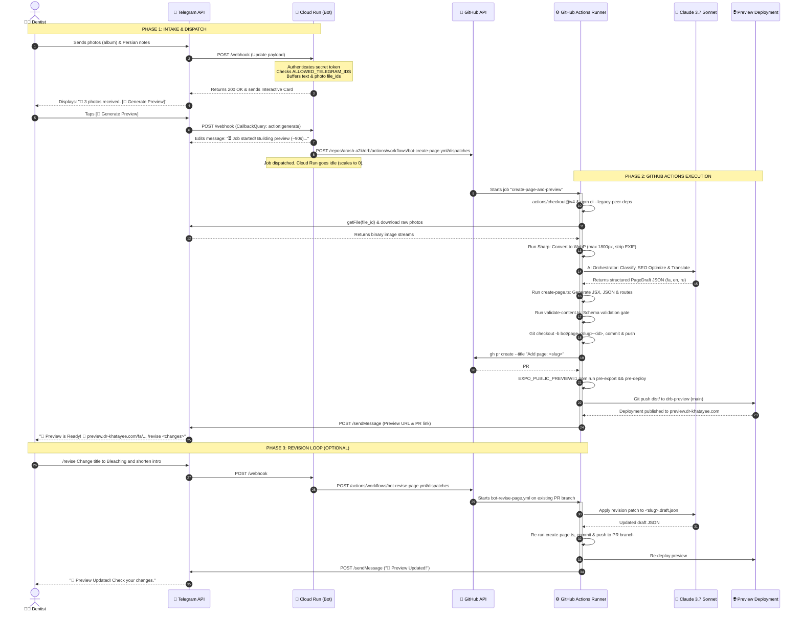

# Telegram Content Bot - Cloud Run + GitHub Actions Architecture

**Date:** 2026-09-24  
**Target:** Engineering Team & Stakeholders  
**Status:** Approved Architecture & Implementation Guide  

---

## 1. Executive Summary

This document details the complete end-to-end architecture for the Dr. Khatayee Telegram Content Bot. The system enables a non-technical end user (e.g. the dentist) to create and revise fully translated, SEO-optimized website pages directly from a Telegram chat.

### Core Architectural Principles
1. **Thin Serverless Gateway (GCP Cloud Run):** The Telegram bot acts exclusively as an intake coordinator. It buffers text and photos, handles user authorization, and triggers background jobs. It holds zero persistent database state and scales to zero ($0/month).
2. **Heavy Lifting in CI (GitHub Actions):** All heavy operations—image optimization, LLM prompt orchestration (Claude 3.7 Sonnet), deterministic page generation, Git branch management, static web export, and preview deployment—run inside GitHub Actions runners.
3. **Zero-Setup GitOps:** Code changes arrive as standard Pull Requests (`bot/page-<slug>-<id>`). Previews are hosted at the domain root of a secondary preview repository (`preview.dr-khatayee.com`) with automated SEO indexing suppression (`noindex,nofollow`).

---

## 2. System Topology & Components Diagram

The diagram below illustrates where each component runs, the network boundaries, protocols, and how secrets are isolated.



---

## 3. End-to-End Sequence & Data Flow Diagram

This sequence diagram depicts the chronological step-by-step lifecycle from the moment the dentist sends notes and photos to the live preview deployment and revision loop.



---

## 4. Deep Dive: Component Responsibilities

### 1. Telegram Bot (GCP Cloud Run)
- **Role:** Thin inbound webhook listener.
- **Location:** Runs on Google Cloud Run (`drb-telegram-bot`) in container `node:22-alpine` (< 100MB footprint).
- **Behavior:**
  - Receives HTTPS POST requests from Telegram at root `/`.
  - Verifies incoming request authenticity using header `X-Telegram-Bot-Api-Secret-Token`.
  - Checks sender `ctx.from.id` against `ALLOWED_TELEGRAM_IDS`. Unauthorized users receive an immediate rejection.
  - Keeps in-memory buffer of incoming photo `file_id`s and text snippets while user is preparing their draft.
  - On user confirmation, dispatches the GitHub Action via HTTP POST to the GitHub REST API.
  - Scales to zero instances when idle ($0.00 compute cost).

### 2. GitHub REST API Dispatch
- **How Cloud Run Calls GitHub:**
  - The bot uses Node's native `fetch` to send an authenticated request:
    ```http
    POST https://api.github.com/repos/arash-a2k/drb/actions/workflows/bot-create-page.yml/dispatches
    Authorization: Bearer <GITHUB_TOKEN>
    Accept: application/vnd.github+json
    X-GitHub-Api-Version: 2022-11-28
    Content-Type: application/json

    {
      "ref": "master",
      "inputs": {
        "chat_id": "12345678",
        "title": "Dental Implants",
        "text": "Full Persian notes sent by user...",
        "photo_file_ids": "AgACAgI...,AgACAgI...",
        "slug": "dental-implants"
      }
    }
    ```
  - Receives HTTP `204 No Content` indicating the workflow is queued.

### 3. GitHub Actions Runner Engine
- **Role:** High-powered build and execution worker.
- **Location:** GitHub-hosted standard Linux runner (`ubuntu-latest`, 2 vCPU, 7 GB RAM, 14 GB SSD).
- **Execution Lifecycle:**
  1. **Dependencies:** Checks out repository and runs `npm ci --legacy-peer-deps`.
  2. **Image Intake:** Script `download-telegram-photos.ts` uses Telegram's `getFile` API to download raw photos into `tmp/telegram-images`.
  3. **Image Optimization:** Script `optimize-images.ts` uses `sharp` to strip EXIF, rotate by orientation tag, scale to max width 1800px, and output WebP files into `assets/images/generated/<slug>/`.
  4. **AI Generation:** Calls `run-create-page.ts` which invokes `AnthropicModelClient` using `claude-3-7-sonnet-20250219`. It runs three prompt contracts:
     - `classify-page-type`: Chooses template and navigation placement.
     - `seo-page-optimizer`: Optimizes Persian text, H1/H2 hierarchy, target keywords, FAQ, and pricing guidance note.
     - `translate-page`: Generates complete English (`en`) and Russian (`ru`) translations with identical schema structures.
  5. **Deterministic Assembly:** Calls `create-page.ts` to output:
     - Route wrapper (`app/[lang]/treatments/<slug>/index.jsx` or `app/[lang]/<slug>.jsx`).
     - Persian redirect (`app/treatments/<slug>/index.js` or `app/<slug>.js`).
     - Translated content JSON (`<slug>.json`).
     - Navigation updates in `components/header/header.json`.
     - Preserves lossless intermediate representation in `packages/content-automation/drafts/<slug>.draft.json`.
  6. **Validation Gate (H1):** Runs `npm run validate:content -- --file packages/content-automation/drafts/<slug>.draft.json` directly against the generated draft schema. If invalid, the workflow fails immediately and nothing is committed.
  7. **Pull Request Automation (H2):** Creates branch `bot/page-<slug>-<run_id>`, commits generated files without `[skip ci]`, pushes to `origin`, and opens a PR via `gh pr create`. This allows the repository's standard `validate.yml` CI workflow to run on every PR.
  8. **Preview Export & Assertion (H3):**
     - Sets `EXPO_PUBLIC_PREVIEW: '1'` at the step environment level.
     - Runs `npm run pre-export` and `npm run pre-deploy`.
     - Executes a build assertion verifying that `dist/index.html` actually contains `<meta name="robots" content="noindex,nofollow">`. Fails the job if missing.
  9. **Preview Deployment Gate (H4):**
     - Requires `PREVIEW_DEPLOY_KEY` to be present; exits with an error instead of silently skipping.
     - Pushes `dist/` directly to root of `drb-preview` repo via SSH key `PREVIEW_DEPLOY_KEY`.
  10. **Direct Feedback:** Invokes Telegram Bot API via `curl` to post the preview link and PR link. The success message is only dispatched if both generation and deployment steps succeeded.

---

## 5. Security & Access Control Model

| Vector | Control | Mechanism |
|---|---|---|
| **Public Ingress (C2)** | Fail-Closed Secret Token | Cloud Run strictly requires `TELEGRAM_WEBHOOK_SECRET` ($\ge 32$ chars). The bot refuses to boot in webhook mode without it and verifies `X-Telegram-Bot-Api-Secret-Token` on every update. |
| **User Authorization & Privacy** | Silent Drop Allowlist | Checks `ctx.from.id` against `ALLOWED_TELEGRAM_IDS` and `ctx.chat.id` against `ALLOWED_CHAT_IDS`. Rejects unauthorized traffic silently with zero reply, preventing bot discovery, reconnaissance, and API quota exhaustion. |
| **Cost & Abuse Protection** | Multi-Layer Rate Limits | In-memory 5 dispatches/user/24h limit, 15 workflow runs/day repository circuit breaker, and 10 photos/session payload caps. |
| **Durable Session (Cold Start)** | GitHub API PR Rehydration | The bot recovers active slug and branch directly from open GitHub PRs (`bot/page-*`), surviving Cloud Run scale-to-zero without an external database. |
| **Clinical Governance (Safeguards)** | Mandatory Privacy Checklist & /approve | Pages are opened as Draft PRs with Clinical & Patient Privacy checklists. `/approve` records supervising clinician identity and audit timestamp directly on the GitHub PR. |
| **GitHub Access (H5)** | Ephemeral App Tokens | The bot uses a GitHub App to mint short-lived (1-hour), revocable installation tokens via RS256 JWTs on demand, avoiding long-lived standing PATs in public containers. |
| **Revision Overwrites (C3)** | Immutable Structural Fields | Revisions only permit updating content text and image alt tags. `slug`, `pageType`, `navPlacement`, and image `src` are frozen code-side; model attempts to mutate `slug` are rejected. |
| **Validation Gate (H1)** | Active Draft Schema Gate | CI actively validates the generated draft JSON (`packages/content-automation/drafts/<slug>.draft.json`) before committing. |
| **PR Verification (H2 & Recursion Guard)** | Full CI via workflow_run | Commits trigger `validate.yml` directly or via `workflow_run` to bypass GitHub Actions token recursion limits. |
| **SEO Defense (H3)** | Verified `noindex` Preview | Builds set `EXPO_PUBLIC_PREVIEW=1` at step level with post-build grep assertion. Crawl access is allowed (no `robots.txt` disallow) so search engines read and honor the noindex tag. |
| **Production Branch** | Protected `master` | The bot never writes to `master`. All changes enter via Pull Requests requiring human review and merge. |

---

## 6. Deployment Guide: Deploying the Bot to Cloud Run

### Prerequisites
- GCP Project with Cloud Run and Secret Manager APIs enabled.
- Google Cloud CLI (`gcloud`) authenticated on your local machine.

### Step 1: Create Secrets in GCP Secret Manager
```bash
# Set active project
gcloud config set project dr-bob-website

# 1. Telegram Bot Token
echo -n "YOUR_TELEGRAM_BOT_TOKEN" | gcloud secrets create TELEGRAM_BOT_TOKEN --data-file=-

# 2. GitHub Dispatch Token (PAT with actions:write)
echo -n "YOUR_GITHUB_TOKEN" | gcloud secrets create GITHUB_TOKEN --data-file=-

# 3. Allowed User IDs
echo -n "12345678,98765432" | gcloud secrets create ALLOWED_TELEGRAM_IDS --data-file=-

# 4. Webhook Secret Token (Random 32-character hex/alphanumeric)
echo -n "super-secret-random-token-123456" | gcloud secrets create TELEGRAM_WEBHOOK_SECRET --data-file=-
```

### Step 2: Deploy Container to Cloud Run
From the root of the `drb` repository (repository root context is required by `packages/telegram-bot/Dockerfile` to copy workspace manifests):
```bash
# 1. Build and push container image using Cloud Build configuration
PROJECT_ID=$(gcloud config get-value project)
gcloud builds submit \
  --config packages/telegram-bot/cloudbuild.yaml \
  --substitutions _IMAGE_TAG="gcr.io/${PROJECT_ID}/drb-telegram-bot:latest" \
  .

# 2. Deploy image to Cloud Run
gcloud run deploy drb-telegram-bot \
  --image "gcr.io/${PROJECT_ID}/drb-telegram-bot:latest" \
  --platform managed \
  --region europe-west1 \
  --allow-unauthenticated \
  --min-instances 0 \
  --max-instances 1 \
  --memory 256Mi \
  --set-env-vars GITHUB_REPO="arash-a2k/drb" \
  --set-secrets TELEGRAM_BOT_TOKEN=TELEGRAM_BOT_TOKEN:latest \
  --set-secrets GITHUB_TOKEN=GITHUB_TOKEN:latest \
  --set-secrets ALLOWED_TELEGRAM_IDS=ALLOWED_TELEGRAM_IDS:latest \
  --set-secrets TELEGRAM_WEBHOOK_SECRET=TELEGRAM_WEBHOOK_SECRET:latest
```
*(Optional: If restricting to a specific Telegram group or chat, also add `--set-secrets ALLOWED_CHAT_IDS=ALLOWED_CHAT_IDS:latest`)*

### Step 3: Configure Webhook URL
Once deployed, retrieve the assigned Cloud Run URL (e.g., `https://drb-telegram-bot-xxxx.a.run.app`):
```bash
SERVICE_URL=$(gcloud run services describe drb-telegram-bot --region europe-west1 --format 'value(status.url)')

# Update Cloud Run environment variable with its own public URL
gcloud run services update drb-telegram-bot \
  --region europe-west1 \
  --update-env-vars WEBHOOK_URL="$SERVICE_URL"
```

The bot's startup code in `packages/telegram-bot/src/index.ts` automatically calls `bot.api.setWebhook(...)` on boot with `secret_token: TELEGRAM_WEBHOOK_SECRET`. Webhook delivery is immediately live!

---

## 7. Cost Model (At 5 Page Runs / Day)

| Resource | Monthly Usage | Cost |
|---|---|:---:|
| **GCP Cloud Run** | ~3,000 webhook requests (< 1% of 2M free quota) | **$0.00** |
| **GCP Secret Manager** | 5 secrets | **$0.00** |
| **GitHub Actions** | ~375 minutes (18.7% of 2,000 free quota) | **$0.00** |
| **GitHub Pages** | Static preview hosting on `drb-preview` | **$0.00** |
| **Anthropic API (Claude 3.7 Sonnet)** | ~150 page generations/revisions ($0.15/page) | **~$15 – $22** |
| **Total Operational Cost** | Infrastructure: **$0.00** / LLM: **~$20/mo** | **~$20 / month** |
