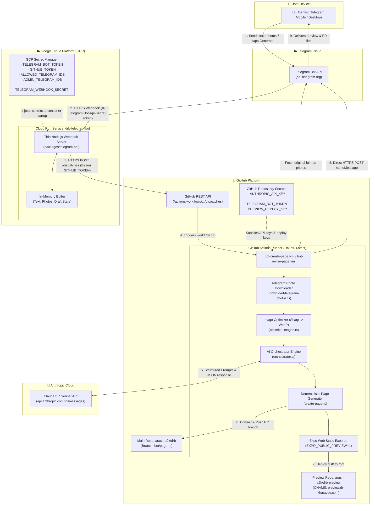

# Telegram Content Bot - System Topology & Component Diagram

This diagram maps every architectural block, execution environment, network boundary, communication protocol, and security boundary for the Dr. Khatayee Telegram Content Bot.

---

## Component Roles & Boundaries

| Component | Host / Runtime | Responsibility | Protocol / Auth |
|---|---|---|---|
| **Telegram Bot** | GCP Cloud Run | Inbound webhook receiver, authorization check, session buffer, workflow dispatcher | HTTPS (`X-Telegram-Bot-Api-Secret-Token`) |
| **GitHub REST API** | GitHub Cloud | Receives workflow dispatch requests from Cloud Run | HTTPS (`Bearer GITHUB_TOKEN`) |
| **Actions Runner** | GitHub Ubuntu Runner | Photo download, image optimization, AI orchestration, static export, and preview deploy | Native Runner environment |
| **Claude 3.7 Sonnet** | Anthropic API | Medical SEO optimization, classification, and 3-language translation (`fa`, `en`, `ru`) | HTTPS (`x-api-key: ANTHROPIC_API_KEY`) |
| **Preview Site** | GitHub Pages (`drb-preview`) | Live static preview at root CNAME `preview.dr-khatayee.com` with `noindex,nofollow` | HTTPS / SSH Deploy Key |
